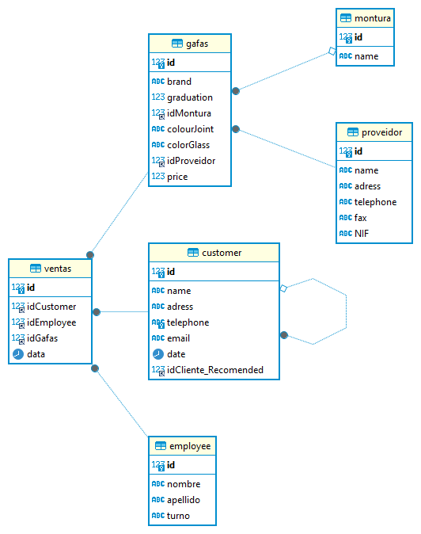

## CONSULTAS A BASES DE DATOS CON SQL

Todos los comando posibles:

Ejecutar el eslint:

```sh
npm run eslint
```

Ejecutar la inyeción a la base de datos SQLlite de manera local:

```sh
npm run inject
```

Este es una serie de ejercicios prácticos donde se implementará las consultas a la base de datos con MySQL, la gestión de la base de datos se ha hecho mediante el programa DBeaver.

En un base de datos, crearemos la estructura de las tablas que estarán conectadas mediante los `foreing key`, consiguiendo el diagrama relacional siguiente:



En este ejemplo, se ha conseguido mediante script ejecutado en el DBeaver previamente conectado a una conexión MySQL y también mediante inyecciones en código a una base de datos local `tursoDB.db`.
